SUBNETTING
======================

Modul 4 kali ini akan membahas tentang ***Subnetting***

- [A. PENGENALAN](#a-pengenalan)
    - [Istilah](#istilah)
    - [IP Address](#ip-address)
    - [Subnet](#subnet)
    - [Network ID, Broadcast Address, dan Available Hosts](#network-id-broadcast-address-dan-available-hosts)
        - [Network ID](#network-id)
        - [Broadcast Address](#broadcast-address)
        - [Available Hosts](#available-hosts)
    - [IP Publik dan IP Privat](#ip-publik-dan-ip-privat)
    - [Let’s Wrap and Warm Up!](#lets-wrap-and-warm-up)
- [B. SUBNETTING](#b-subnetting)
    - [Pengertian](#pengertian)
    - [Perhitungan Subnet](#perhitungan-subnet)
        - [A. Classful](#a-classful)
        - [B. Classless](#b-classless)
            - [1. VLSM (Variable Length Subnet Masking)](#1-vlsm-variable-length-subnet-masking)
            - [2. CIDR (Classless Inter Domain Routing)](#2-cidr-classless-inter-domain-routing)
            - [3. FLSM (Fixed Length Subnet Mask))](#3-flsm-fixed-length-subnet-mask)

## A. PENGENALAN
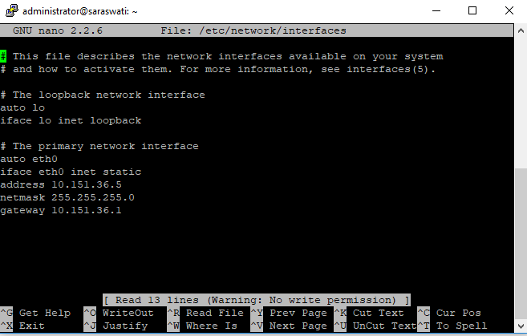

### Istilah

Istilah | Penjelasan
--------|-----------
iface | Disebut network interface, antarmuka yang menghubungkan 2 layer protokol. Setiap interface memiliki nama yang berbeda
eth0 | Salah satu nama interface yang digunakan untuk berhubungan dengan subnet
address | Sebuah alamat IP unik bagi komputer dalam sebuah jaringan
netmask | Kombinasi angka sepanjang 32 bit yang berfungsi membagi IP ke dalam subnet-subnet dan menentukan rentang alamat IP pada subnet yang bisa digunakan
gateway | Alamat IP yang menjadi pintu keluar menuju subnet lain, biasanya diisi alamat IP router terdekat

**Mengapa Perlu Subnetting?**

Sebagai permisalan, wilayah Indonesia perlu dibagi menjadi bagian-bagian kecil (provinsi, kota, dan seterusnya). Tujuannya untuk memudahkan pemerintah dalam mengatur kebijakan sesuai kondisi dari daerah masing-masing. Hal tersebut juga yang terjadi pada jaringan internet. Jaringan mencakup seluruh koneksi antar komputer yang terhubung ke internet.
Manfaat subnetting :
- Meningkatkan efisiensi routing
- Dapat mengatur kebijakan sendiri untuk keamanan jaringan
- Mengurangi ukuran broadcast domain

### IP Address
IP Address (Versi 4)

- Alamat IP adalah suatu alamat unik yang diberikan untuk menandai sebuah komputer yang terhubung dalam suatu jaringan.
- Alamat IP terdiri dari 32 bit biner yang dalam penulisannya dikonversi menjadi bilangan desimal.
- Alamat IP (yang panjangnya 32 bit itu) dibagi menjadi 4 oktet (masing-masing oktet berisi 8 bit) dipisahkan dengan tanda titik.

### Subnet

### Network ID, Broadcast Address, dan Available Hosts
Jika suatu PC memiliki alamat 10.151.36.5/24, maka informasi yang dapat digali dari IP tersebut adalah:

1. Alamat IP
2. Netmask
3. Network ID (NID) : Sebuah alamat IP yang menjadi identitas untuk suatu area jaringan/subnet
4. Broadcast Address : Sebuah alamat IP yang berperan untuk pengiriman pesan broadcast dalam suatu jaringan/subnet
5. Available Hosts: Rentang alamat IP yang bisa digunakan dalam suatu jaringan/subnet

Contoh skenario:
    Carilah Network ID (NID), Broadcast Address, dan rentang alamat IP dari sebuah alamat 10.151.36.5/24!

Penyelesaian :
    Informasi sementara yang didapat dari 10.151.36.5/24 adalah

        1. IP : 10.151.36.5
        2. Netmask : 255.255.255.0 (/24)
        3. Network ID?
        4. Broadcast Address?
        5. Available Host?

   Berikut akan dijelaskan bagaimana mencari NID, Broadcast Address, dan Available Host:

#### Network ID
Mencari Network ID (NID)

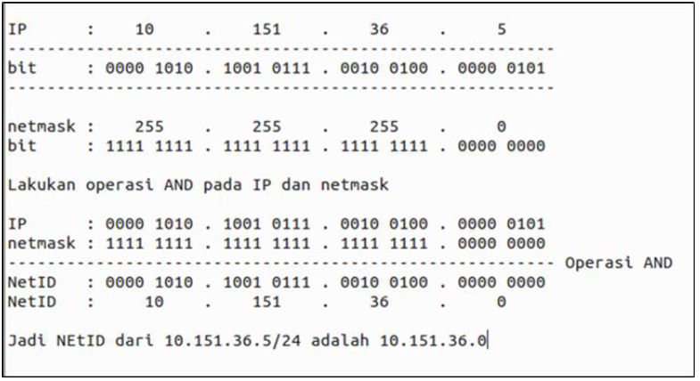

#### Broadcast Address
Mencari Broadcast Address

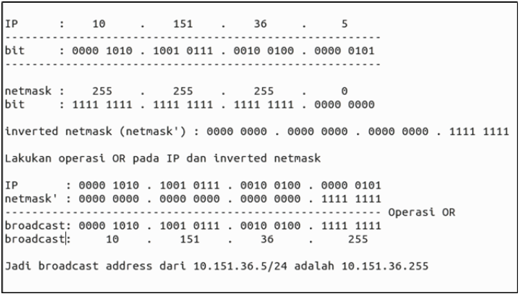

#### Available Hosts
Mencari rentang alamat IP

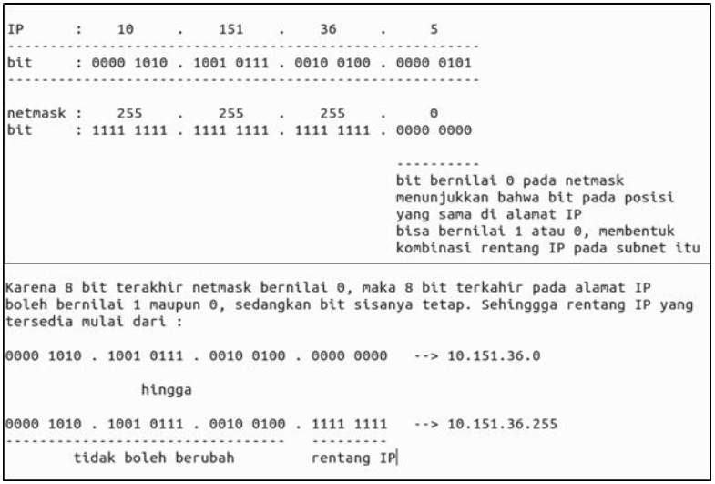

### IP Publik dan IP Privat
Alamat IP dibagi menjadi 2 jenis, yaitu :
- IP Publik = alamat IP yang digunakan dalam jaringan global Internet, cirinya alamat IP dapat diakses melalui internet secara langsung.
- IP Privat = alamat IP yang digunakan (dikenali) dan hanya dapat diakses oleh jaringan lokal.

Rentang IP Privat :
- 10.0.0.0/8 (Class A)
- 172.16.0.0/16, (Class B)
- 192.168.0.0/24 (Class C)

Rentang IP Publik adalah selain rentang IP Privat di atas.

### Let’s Wrap and Warm Up!
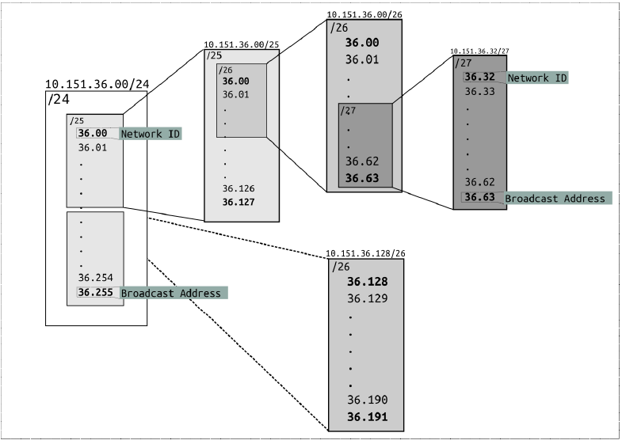

**Mari Diskusi**

1. Carilah Network ID, Broadcast Address dan rentang alamat IP dari 172.16.1.27/29
2. Apakah IP 10.151.36.5/24 dan 10.151.36.128/24 berada dalam satu subnet? Sebutkan alasannya.
3. Apakah IP 10.151.252.5/22 dan 10.151.253.10/22 berada dalam satu subnet? Sebutkan alasannya.

## B. SUBNETTING
### Pengertian

**Subnet** adalah suatu sub jaringan dari jaringan yang lebih besar. Dengan adanya subnet, kita dapat melakukan manajemen suatu jaringan dengan lebih baik.

**Tujuan** utama kita belajar subnetting adalah **pembagian alamat IP untuk kebutuhan tertentu**. Contohnya pada gedung Departemen Informatika dimana terdapat beberapa laboratorium, dan setiap laboratorium memiliki lebih dari 1 komputer yang harus dikonfigurasikan sedemikian rupa agar dapat saling berkomunikasi dan mengakses internet.

Dari contoh tersebut, muncullah salah satu konfigurasi paling dasar dalam penyelesaian permasalahan ini yaitu pembagian alamat IP untuk setiap laboratorium di gedung Departemen Informatika, seperti :
1. Laboratorium LP memiliki jaringan dengan subnet **10.151.34.0/24**
2. Laboratorium AJK memiliki jaringan dengan subnet **10.151.36.0/24**

### Perhitungan Subnet
Ada tiga metode pembagian IP yang dikenal dalam jaringan, yaitu Classful

#### A. Classful
Pembagian IP dengan menggunakan metode ini didasarkan pada pembagian class pada alamat IP. Tiap subnet akan diberikan ukuran atau netmask yang dapat menampung jumlah komputer/ host yang terdapat dalam subnet tersebut. Tabel berikut menunjukkan Class yang terdapat pada metode ***Classful***.

Class | Netmask | Jumlah Host
------|---------|------------
Class A | /8 | 16777216
Class B | /16 | 65536
Class C | /24 | 256

Contoh penerapan pembagian alamat IP dengan metode ***Classful*** sebagai berikut.

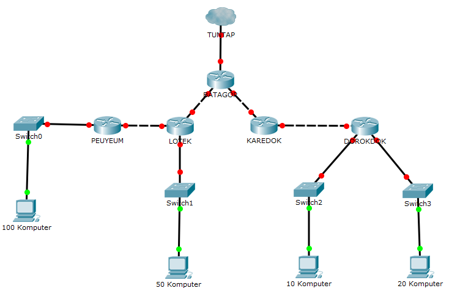

Anggap kita memiliki topologi jaringan seperti gambar di atas. Lalu, tentukan jumlah subnet yang ada di dalam topologi tersebut.

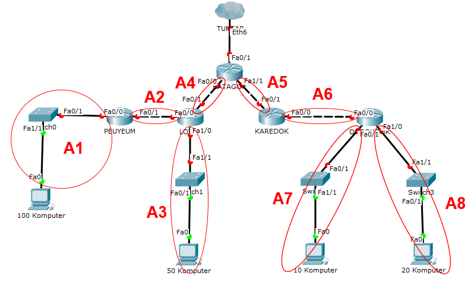

Terdapat 8 subnet di dalam topologi. Dengan menggunakan teknik classful setiap subnet akan memiliki netmask /24 karena semua subnet memiliki jumlah host di bawah 256. Sehingga pembagian IP yang memungkinkan untuk topologi di atas adalah sebagai berikut.

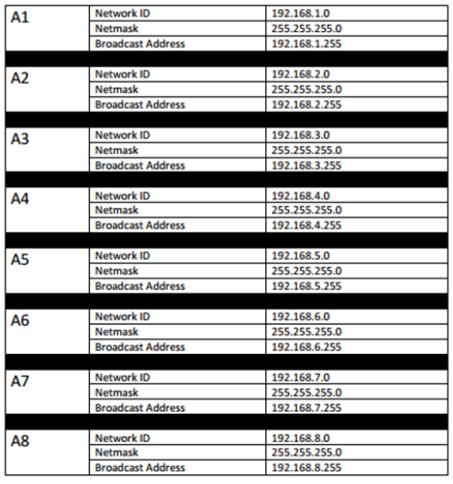

#### B. Classless

##### 1. VLSM (Variable Length Subnet Masking)

Inti utama dari penggunaan teknik VLSM adalah untuk mengefisienkan pembagian IP di dalam jaringan. Besar netmask disesuaikan dengan banyaknya komputer/ host yang membutuhkan alamat IP.

> Jadi, pada teknik **VLSM**, subnet mask (netmask) akan diberikan sesuai dengan kebutuhan jumlah alamat IP dari subnet tersebut.
Contoh penerapannya, kita akan menggunakan topologi seperti contoh metode ***Classful***.

**Langkah 1** - Tentukan jumlah alamat IP yang dibutuhkan oleh tiap subnet dan lakukan *labelling* netmask berdasarkan jumlah IP yang dibutuhkan.

Subnet | Jumlah IP | Netmask
-------|:---------:|:------:
 A1 | 101 | /25 |
 A2 | 2 | /30
 A3 | 51 | /26
 A4 | 2 | /30
 A5 | 2 | /30
 A6 | 2 | /30
 A7 | 11 | /28
 A8 | 21 | /27
**Total** | **192** | **/24**

Berdasarkan total IP dan netmask yang dibutuhkan, maka kita dapat menggunakan netmask **/24** untuk memberikan pengalamatan IP pada subnet.

**Catatan**

> Penentuan subnet mask (netmask) ***root*** dalam pembagian IP tidak hanya berdasarkan **jumlah** IP yang dibutuhkan, tetapi perlu diperhatikan juga berapa banyak netmask yang dibutuhkan oleh subnet yang ada dalam topologi tersebut. Seperti pada contoh yang kita gunakan, karena netmask terbesar yang dibutuhkan adalah **/25** dan hanya terdapat 1 subnet yang membutuhkan subnet tersebut, maka pembagian IP dapat dilakukan mulai dari netmask **/24**.
**Langkah 2** - Subnet besar yang dibentuk memiliki NID **192.168.1.0** dengan netmask **/24**. Hitung pembagian IP berdasarkan NID dan netmask tersebut menggunakan pohon seperti gambar di bawah.

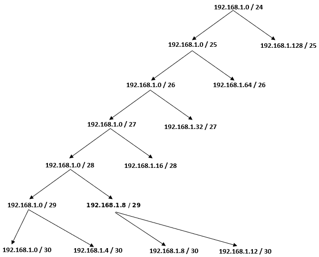

**Langkah 3** - Lakukan subnetting dengan menggunakan pohon tersebut untuk pembagian IP sesuai dengan kebutuhan masing-masing subnet yang ada.

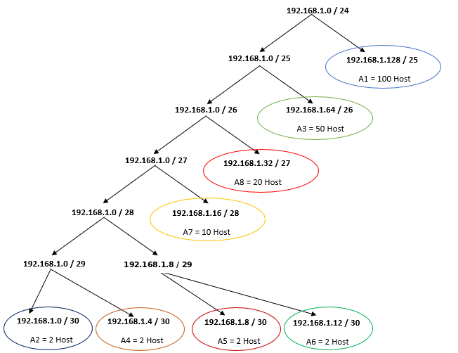

Dari pohon dari pohon tersebut akan mendapat pembagian IP sebagai berikut.

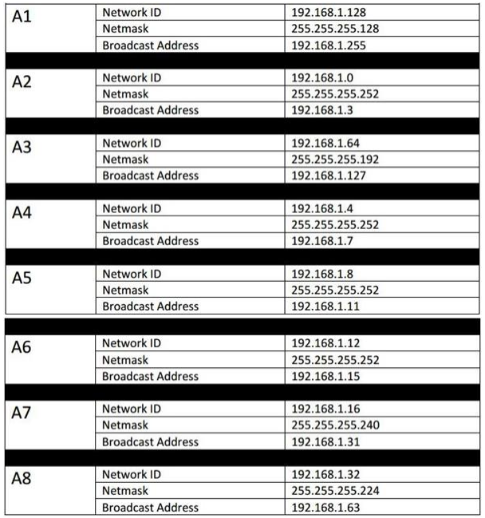

##### 2. CIDR (Classless Inter Domain Routing)

Perhitungan pada teknik CIDR juga didasarkan pada jumlah komputer/ host yang ada di dalam subnet. Tetapi cara mendapatkan subnet besar tidak sama dengan VLSM. Penerapan teknik CIDR dapat dilakukan dengan langkah sebagai berikut.

**Langkah 1** - Tentukan subnet yang ada dalam topologi dan lakukan *labelling* netmask terhadap masing-masing subnet. Contohnya dapat dilihat pada gambar berikut.
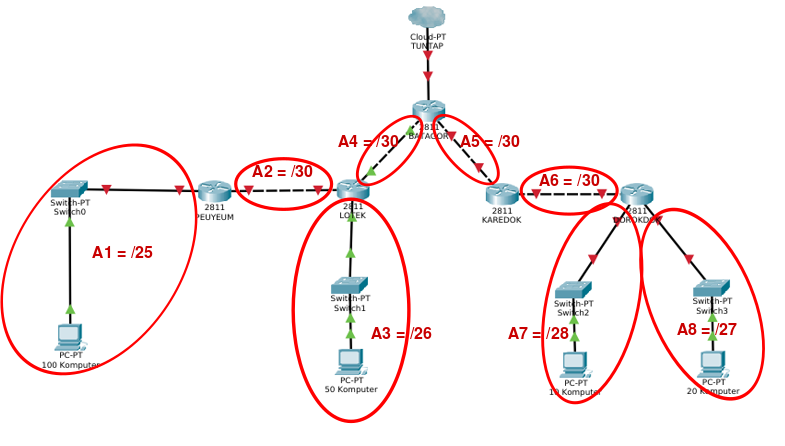

**Langkah 2** - Gabungkan subnet paling bawah di dalam topologi. Paling bawah berarti subnet yang paling jauh dari internet (gambar awan). Maka pada topologi yang digunakan kali ini, subnet yang dapat digabungkan adalah **A1** dengan **A2** dan subnet **A7** dengan **A8**. Subnet yang digabung tersebut akan membentuk sebuah subnet lebih besar dari subnet-subnet kecil yang ada di dalamnya.
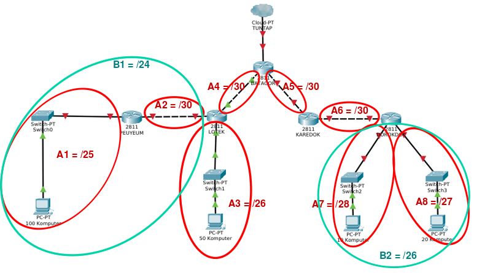

Subnet **B1** merupakan hasil penggabungan dari subnet **A1** dan **A2**, Subnet **B2** merupakan hasil penggabungan dari subnet **A7** dan **A8**.

> ***Mengapa subnet B1 memiliki netmask /24? Dan subnet B2 memiliki netmask /26?***
Perhatikan subnet **A1** dan **A2**. Subnet **A1** memiliki netmask /25, dan subnet **A2** memiliki netmask /30. Pada teknik **CIDR** subnet gabungan akan memiliki netmask yang **1 tingkat di atas subnet terbesar yang digabungkan**. Berdasarkan contoh di atas A1 = /25 dan A2 = /30, maka jika dilakukan penggabungan akan menjadi subnet **B1** dengan netmask **/24**. Begitu pula dengan subnet B2.

Lalu ulangi langkah tersebut sampai menjadi sebuah subnet besar yang mencakup 1 topologi yang kita miliki.

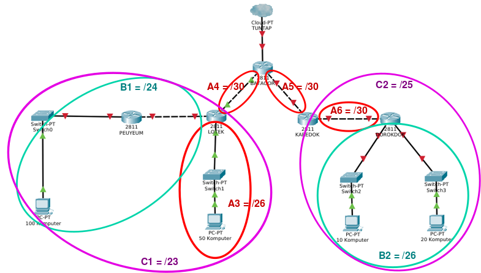

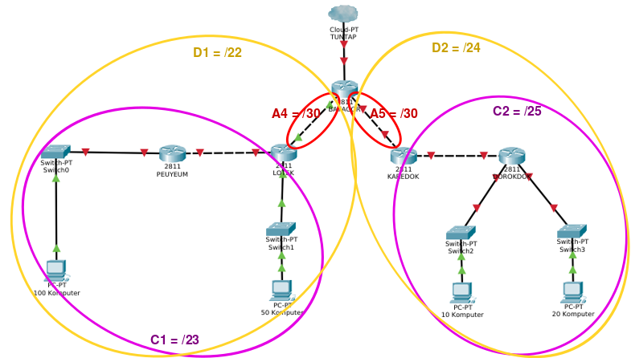

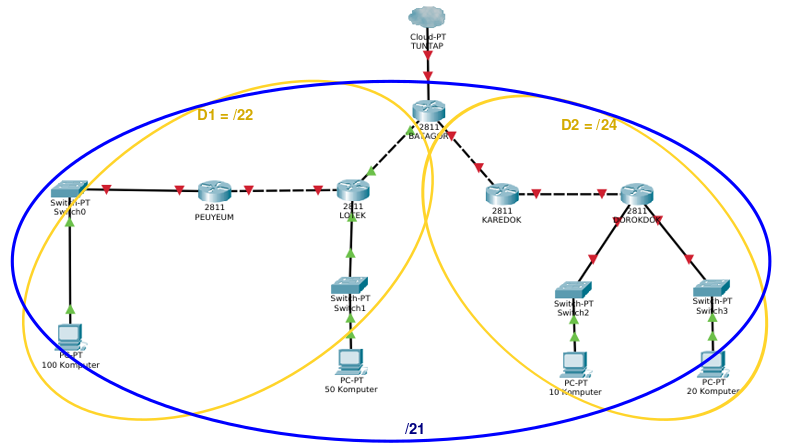

**Langkah 3** - Dari proses penggabungan yang telah dilakukan, didapatkan sebuah subnet besar dengan netmask **/21**. Kali ini dapat menggunakan NID **192.168.0.0**, netmask **255.255.248.0**.

**Langkah 4** - Hitung pembagian IP dengan pohon berdasarkan penggabungan subnet yang telah dilakukan.

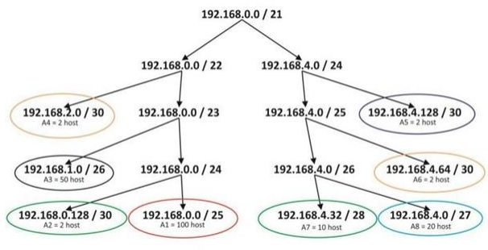

> **Catatan**
> **Perbedaan** antara pohon VLSM dengan pohon CIDR adalah ketika satu subnet diturunkan, netmask yang akan terbentuk **disesuaikan dengan penggabungan subnet** yang telah dilakukan sebelumnya. Sebagai contoh, dari netmask besar /21, pada teknik VLSM akan dibagi dua menjadi masing-masing /22. Namun pada penggabungan yang dilakukan sebelumnya, /21 dihasilkan dari penggabungan /22 dan /24 maka subnet yang terbentuk memiliki netmask /22 dan /24.
**Langkah 5** - Berdasarkan penghitungan, maka didapatkan pembagian IP sebagai berikut.

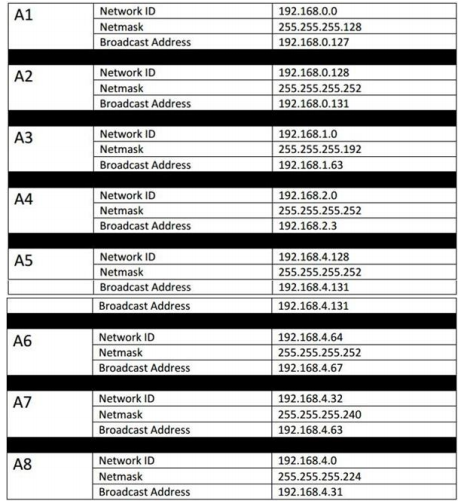

Jika kalian menggunakan CIDR maka netmask yang terbentuk akan menjadi lebih besar dibandingkan dengan menggunakan VLSM. Tetapi salah satu **keunggulan** teknik **CIDR** adalah ketika terdapat subnet baru yang ditambahkan dalam topologi, **tidak perlu melakukan penghitungan kembali** karena kemungkinan besar masih ada interval (*range*) IP yang tidak terpakai. Selain itu, teknik CIDR juga mengefisienkan *routing* karena umumnya tabel routing yang dimiliki lebih sederhana dibandingkan teknik VLSM.

##### 3. FLSM (Fixed Length Subnet Mask)
Satu network, kita pecah-pecah menjadi beberapa network (subnet) dimana setiap lebar subnet yang satu sama dengan lebarsubnet yang lainnya. 
Contohnya sebagai berikut :

**Percobaan Perhitungan Subnetting dan Netmask Kelas C**

Diketahui sebuah IP Address adalah “192.168.1.0/27” , buatlah tabel pembagian subnet nya !

-   Menghitung jumlah subnet :
    Diketahui netmasknya adalah “/27”
    
    /27 = **11111111. 11111111. 11111111.111**00000
    
    /27 = 255.255.255.**224**
    
-   Jumlah Subnet :
    Untuk menghitung jumlah subnet maka Subnet = 2^n = n, 
    
    dimana n = jumlah bit yang aktif (angka 1) dimulai dari oktet keempat (C).
    
    2^3 = 8 Subnet
    
- Menghitung jumlah host per subnet Jumlah
    Untuk menghitung jumlah host maka Host = 2^x - 2, 
    
    dimana x = sisa bit 0 dalam bilangan biner netmask.
    
    Host = 2⁵ - 2 = 32 
    
    32 - 2 = 30 Host
    
- Blok Subnet
    Rumus Blok Subnet Mask : 256 - z, 
    
    dimana z = adalah notasi desimal dari oktet kedua netmask.

    256-224 = 32

    (0,32,64,96,128,160,192,224)

**BLOK SUBNET**
BLOK SUBNET |1 |2 |... |7 | 8
------------|--|--|----|--|--
NETWORK   | 192.168.1.0  |	192.168.1.32    |	…	|192.168.1.192  |	192.168.1.224
IP AWAL   | 192.168.1.1  |	192.168.1.33    |	…	|192.168.1.193  |	192.168.1.225
IP AKHIR  | 192.168.1.30 |	192.168.1.62    |	…	|192.168.1.222  |	192.168.1.254
BROADCAST | 192.168.1.31 |  192.168.1.63    |	…	|192.168.1.223  |	192.168.1.255
